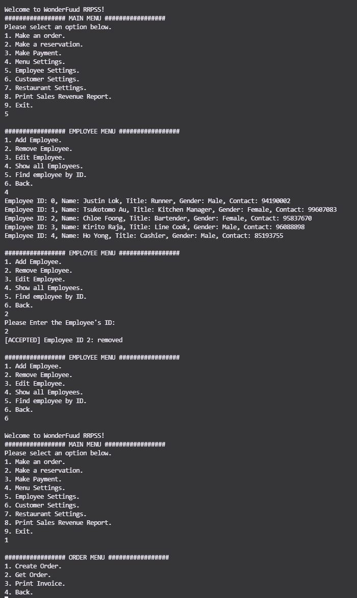

# Restaurant Reservation and Point of Sale System (RRPSS)

### ⚙️ Technologies Used:

---

## Introduction
The RRPSS is a Command Line Interface application to computerize the process of making reservation, recording of orders and displaying of sale records.

---

## Requirements

The following are information about the application:
> 1. Menu items should be categorized according to its type, eg, Main course, drinks, dessert, etc.
> 2. Menu items can be added with details like name, description, price.
> 3. Promotional set package comes in a single package price with descriptions of the items to be served.
> 4. A customer may order a set package and ala carte menu items as well.
> 5. An order should indicate the staff who created the order.
> 6. Staff information can be in the form of name, gender, employee ID and job title.
> 7. Reservation is made by providing details like date, time, #pax, name, contact, etc. The system should check availability and allocate a suitable table.
> 8. When a reservation is made, a table is reserved till the reservation booking is removed.
> 9. Table comes in different seating capacity, in even sizes, with minimum of 2 and maximum of 10 pax ("Persons At Table").
> 10. Order invoice can be printed to list the order details (eg, table number, timestamp) and a complete breakdown of order items details with taxes details.
> 11. Discounts can be given to customers who hold membership of the restaurant or other entities.
> 12. Sale revenue report will detail the period, individual sale items (either ala carte or promotional items) and total revenue.

---

## Sample Image
The image below shows a screenshot of the running program for illustration purposes. 
 
 

